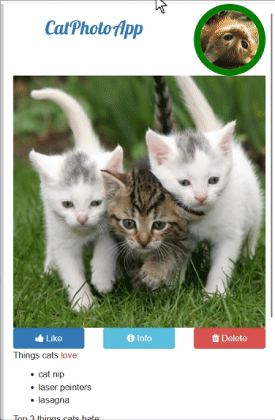

## Cat Photo App

## Bootstrap Features

1. **Responsive Layout**: Utilizes the `.container-fluid` and `.row` classes to create a responsive grid layout.
2. **Column System**: Uses `.col-xs-*` classes to define the width of columns for different screen sizes.
3. **Text Utilities**: Classes like `.text-primary` and `.text-center` are used to style text.
4. **Image Responsiveness**: The `.img-responsive` class makes images responsive, scaling them according to the parent container.
5. **Button Styles**: Buttons are styled using classes like `.btn`, `.btn-block`, and specific color classes like `.btn-primary`, `.btn-info`, and `.btn-danger`.
6. **Form Controls**: Bootstrap provides styling for form elements, including `.form-control` for text inputs.
7. **Icon Integration**: Font Awesome icons are integrated into buttons for visual enhancement.
8. **Alerts**: The `.alert` class is used to create alert boxes with different contextual classes like `.alert-success`, `.alert-info`, `.alert-warning`, and `.alert-danger`.
9. **Tables**: The `.table` class is used to style tables with optional classes like `.table-striped`, `.table-bordered`, and `.table-hover`.
10. **Modal Windows**: The `.modal` class is used to create modal windows with optional classes like `.modal-lg` and `.modal-sm`.
