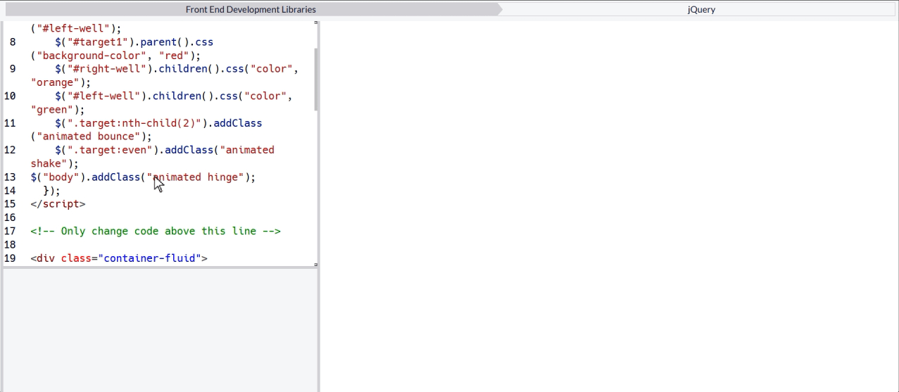

# jQuery Playground

## Overview
This project is a simple jQuery playground that demonstrates various jQuery functionalities through interactive buttons.

## Features Used

1. **Document Ready**:  The code inside `$(document).ready(function() {...});` ensures that the DOM is fully loaded before executing any jQuery code.

2. **CSS Manipulation**:  
   - `$("#target1").css("color", "red");` changes the text color of the button with ID `target1` to red.

3. **Property Manipulation**:  
   - `$("#target1").prop("disabled", true);` disables the button with ID `target1`.

4. **Element Removal**:  
   - `$("#target4").remove();` removes the button with ID `target4` from the DOM.

5. **Element Repositioning**:  
   - `$("#target2").appendTo("#right-well");` moves the button with ID `target2` to the `#right-well` container.

6. **Element Cloning**:  
   - `$("#target5").clone().appendTo("#left-well");` clones the button with ID `target5` and appends it to the `#left-well` container.

7. **Parent Manipulation**:  
   - `$("#target1").parent().css("background-color", "red");` changes the background color of the parent element of `target1` to red.

8. **Child Element Manipulation**:  
   - `$("#right-well").children().css("color", "orange");` changes the text color of all child elements in `#right-well` to orange.
   - `$("#left-well").children().css("color", "green");` changes the text color of all child elements in `#left-well` to green.

9. **Adding Classes**:  
   - `$(".target:nth-child(2)").addClass("animated bounce");` adds the classes `animated` and `bounce` to the second `.target` button.
   - `$(".target:even").addClass("animated shake");` adds the classes `animated` and `shake` to all even `.target` buttons.

## Usage
To see the effects in action, open the HTML file in a web browser and interact with the buttons.
