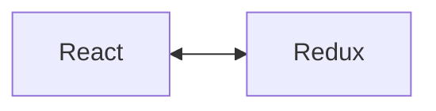

# React + Redux



## Getting Started with React Redux
```jsx
 class DisplayMessages extends React.Component {
  // Change code below this line
constructor(props){
  super(props);
  this.state = {input: "", messages: []}
}

  // Change code above this line
  render() {
    return <div />
  }
};
```
