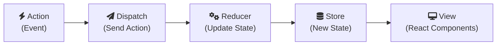

### 1. Action:

    An event occurs in the application (e.g., a button click, an API response).   
    An action object is created to describe this event. It has a type and optionally a payload.  

### 2. Dispatch:

    The dispatch function is called to send the action to the Redux store.

### 3. Reducer:

    The store passes the action to the reducer function.   

### 4. The reducer takes the current state and the action as input.  

    Based on the action's type, the reducer creates and returns a new state object.

### 5. Store:

    The store receives the new state from the reducer.   
    The store updates its internal state.  
    The store notifies all subscribed parts of the application that the state has changed.  

### 6. View (React Components):

    React components that are connected to the store receive the updated state.   

The components re-render to reflect the new state.


## Create a Redux Store
Redux is a state management framework that can be used with a number of different web technologies, including React.
In Redux, there is a single state object that's responsible for the entire state of your application. <br>
This means if you had a React app with ten components, and each component had its own local state, the entire state of your app would be defined by a single state object housed in the Redux store. 

**Most important principle**: the Redux store is the single source of truth when it comes to application state.
```js
const reducer = (state = 5) => {
  return state;
}

// Redux methods are available from a Redux object
// For example: Redux.createStore()
// Define the store here:
const store = Redux.createStore(reducer);
```

## Get State from the Redux Store
```js
const store = Redux.createStore(
  (state = 5) => state
);

// Change code below this line
const currentState = store.getState();
```

## Define a Redux Action
Since Redux is a state management framework, updating state is one of its core tasks. In Redux, all state updates are triggered by dispatching actions. An action is simply a JavaScript object that contains information about an action event that has occurred.
```js
// Define an action here:
const action = {type:'LOGIN'};
```

## Define an Action Creator
```jsx
function actionCreator() {
  return action;
}
```

## Dispatch an action event
dispatch method is what you use to dispatch actions to the Redux store. Calling store.dispatch() and passing the value returned from an action creator sends an action back to the store.
```jsx
const store = Redux.createStore(
  (state = {login: false}) => state
);

const loginAction = () => {
  return {
    type: 'LOGIN'
  }
};

// Dispatch the action here:
store.dispatch(loginAction())
```

## Handle an action in the store
```jsx
const defaultState = {
  login: false
};

const reducer = (state = defaultState, action) => {
  // Change code below this line
if(action.type == 'LOGIN'){
    return {
      login: true
    };
}else{
  return state;
}
  // Change code above this line
};

const store = Redux.createStore(reducer);

const loginAction = () => {
  return {
    type: 'LOGIN'
  }
};
```

## Use switch statement to handle multiple actions
```jsx
const defaultState = {
  authenticated: false
};

const authReducer = (state = defaultState, action) => {
  // Change code below this line
switch(action.type){
  case "LOGIN":
      return {
        authenticated: true
      };

    case "LOGOUT":
      return {
        authenticated: false
      };

    default:
      return defaultState;
  }
}
  // Change code above this line

const store = Redux.createStore(authReducer);

const loginUser = () => {
  return {
    type: 'LOGIN'
  }
};

const logoutUser = () => {
  return {
    type: 'LOGOUT'
  }
};
```

## Use const for Action Types
```jsx


const defaultState = {
  authenticated: false
};
const LOGIN =  'LOGIN';
const LOGOUT =  'LOGOUT';

const authReducer = (state = defaultState, action) => {

  switch (action.type) {
    case LOGIN: // Edited 
      return {
        authenticated: true
      }
    case LOGOUT: // Edited 
      return {
        authenticated: false
      }

    default:
      return state;

  }

};

const store = Redux.createStore(authReducer);

const loginUser = () => {
  return {
    type: LOGIN // Edited
  }
};

const logoutUser = () => {
  return {
    type: LOGOUT // Edited
  }
};
```

## Register a Store Listener
```jsx
const ADD = 'ADD';

const reducer = (state = 0, action) => {
  switch(action.type) {
    case ADD:
      return state + 1;
    default:
      return state;
  }
}; 

const store = Redux.createStore(reducer);

// Global count variable:
let count = 0;

// Change code below this line
store.subscribe(()=>{
  count+=1;
});
// Change code above this line

store.dispatch({type: ADD});
console.log(count);
store.dispatch({type: ADD});
console.log(count);
store.dispatch({type: ADD});
console.log(count);
```

## Combine Multiple Reducers
As applications grow, their state becomes more complex.  Redux addresses this with reducer composition.  Instead of splitting the state itself, you create multiple reducers, each responsible for a distinct part of the application state, and then combine them into a single root reducer.  The combineReducers() method is used for this, taking an object where keys correspond to slices of state and values are the reducers managing those slices.  The example shows combining authenticationReducer and notesReducer into a rootReducer, resulting in a single state object with auth and notes properties. The exercise asks you to combine counterReducer and authReducer into a rootReducer with keys count and auth respectively.
```jsx
const INCREMENT = 'INCREMENT';
const DECREMENT = 'DECREMENT';

const counterReducer = (state = 0, action) => {
  switch(action.type) {
    case INCREMENT:
      return state + 1;
    case DECREMENT:
      return state - 1;
    default:
      return state;
  }
};

const LOGIN = 'LOGIN';
const LOGOUT = 'LOGOUT';

const authReducer = (state = {authenticated: false}, action) => {
  switch(action.type) {
    case LOGIN:
      return {
        authenticated: true
      }
    case LOGOUT:
      return {
        authenticated: false
      }
    default:
      return state;
  }
};

const rootReducer = // Define the root reducer here
Redux.combineReducers({
  count: counterReducer,
  auth: authReducer
})

const store = Redux.createStore(rootReducer);
```

## Send Action Data to the Store
This code demonstrates how to send data along with Redux actions and use that data in a reducer to update the store's state.  The addNoteText() action creator is modified to return an action object with both a type (ADD_NOTE) and a text property (the note data). The notesReducer() is updated to handle the ADD_NOTE action type, extracting the text from the action and using it as the new state.  This allows the Redux store to receive and process data from user interactions.
```jsx
const ADD_NOTE = "ADD_NOTE";

const notesReducer = (state = "Initial State", action) => {
  switch (action.type) {
    // change code below this line

    case ADD_NOTE:
      return action.text;

    // change code above this line
    default:
      return state;
  }
};

const addNoteText = note => {
  // change code below this line

  return {
    type: ADD_NOTE,
    text: note
  };

  // change code above this line
};

const store = Redux.createStore(notesReducer);

console.log(store.getState());
store.dispatch(addNoteText("Hello!"));
console.log(store.getState());
```

## Use Middleware to Handle Asynchronous Actions
Thunk only intercepts functions: The only thing Thunk intercepts is the function returned by `handleAsync()`.
Plain objects bypass Thunk: The calls to `dispatch(requestingData())` and `dispatch(receivedData(data))` dispatch plain objects. These objects are not intercepted by Thunk. They go straight to the reducer (or the next middleware in the chain, if any).
Thunk provides dispatch to the thunk: Thunk's main job is to intercept the thunk function and then call that function, providing it with the dispatch method. This allows the thunk to dispatch regular actions.
```js
const REQUESTING_DATA = 'REQUESTING_DATA'
const RECEIVED_DATA = 'RECEIVED_DATA'

const requestingData = () => { return {type: REQUESTING_DATA} }
const receivedData = (data) => { return {type: RECEIVED_DATA, users: data.users} }

const handleAsync = () => {
  return function(dispatch) {
    // Dispatch request action here
      dispatch(requestingData());

    setTimeout(function() {
      let data = {
        users: ['Jeff', 'William', 'Alice']
      }
      // Dispatch received data action here
      dispatch(receivedData(data));

    }, 2500);
  }
};

const defaultState = {
  fetching: false,
  users: []
};

const asyncDataReducer = (state = defaultState, action) => {
  switch(action.type) {
    case REQUESTING_DATA:
      return {
        fetching: true,
        users: []
      }
    case RECEIVED_DATA:
      return {
        fetching: false,
        users: action.users
      }
    default:
      return state;
  }
};

const store = Redux.createStore(
  asyncDataReducer,
  Redux.applyMiddleware(ReduxThunk.default)
);
```

## Write a counter with Redux
```js

const INCREMENT = 'INC';
const DECREMENT = 'DEC';


// define the counter reducer which will increment or decrement the state based on the action it receives
const counterReducer = (state = 0, action) => {
  switch (action.type) {
    case INCREMENT:
      return state + 1;

    case DECREMENT:
      return state - 1;

    default:
      return state;
  }

  
};

const incAction = () => {
  return {
    type: INCREMENT
  };
};

const decAction = () => {
  return {
    type: DECREMENT
  };
};

const store = Redux.createStore(counterReducer); 
```


## Use the Spread Operator on Arrays
Use the spread operator to return a new copy of state when a to-do is added.
```js
const immutableReducer = (state = ['Do not mutate state!'], action) => {
  switch(action.type) {
    case 'ADD_TO_DO':
      // Don't mutate state here or the tests will fail
       let arr = [...state, action.todo];
      return arr;
    default:
      return state;
  }
};

const addToDo = (todo) => {
  return {
    type: 'ADD_TO_DO',
    todo
  }
}

const store = Redux.createStore(immutableReducer);
```

## Remove an Item from an Array
Time to practice removing items from an array. The spread operator can be used here as well. Other useful JavaScript methods include slice() and concat().
```js
const immutableReducer = (state = [0,1,2,3,4,5], action) => {
  switch(action.type) {
    case 'REMOVE_ITEM':
      // Don't mutate state here or the tests will fail
      return [
        ...state.slice(0, action.index),
        ...state.slice(action.index + 1, state.length)
      ]; 

    default:
      return state;
  }
};

const removeItem = (index) => {
  return {
    type: 'REMOVE_ITEM',
    index
  }
}

const store = Redux.createStore(immutableReducer);
```

## Copy an Object with Object.assign
```js
const defaultState = {
  user: "CamperBot",
  status: "offline",
  friends: "732,982",
  community: "freeCodeCamp"
};

const immutableReducer = (state = defaultState, action) => {
  switch (action.type) {
    case "ONLINE":
      // to enforce state immutability, return a new state object using Object.assign() method
      return Object.assign({}, state, { status: "online" });
    default:
      return state;
  }
};

const wakeUp = () => {
  return {
    type: "ONLINE"
  };
};

const store = Redux.createStore(immutableReducer);
```


